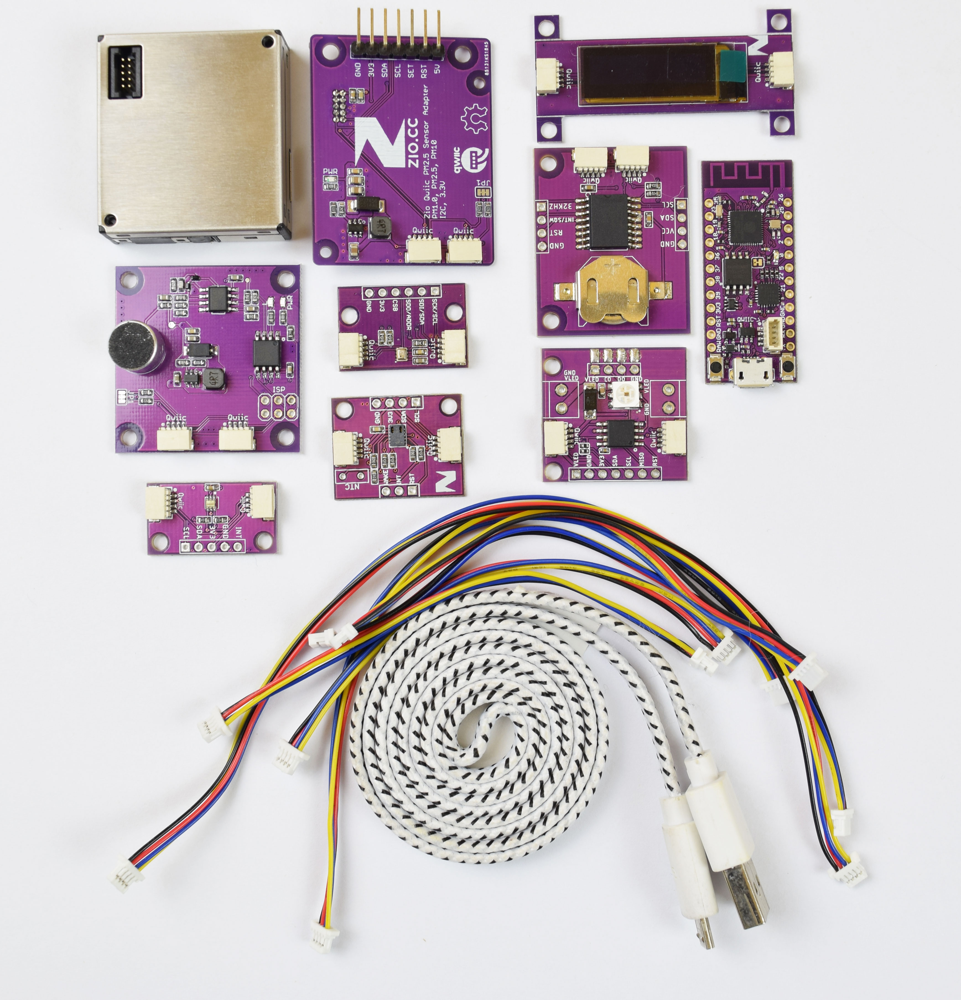

# Indoor-Environment-Sensors

Don't have the kit yet? Purchase them [here](https://www.smart-prototyping.com/Zio-Qwiic-Indoor-Environment-Sensor-Kit)!

Don’t neglect your health by ignoring the indoor quality where you live! This is a Qwiic Sensors kit that any DIY/Maker can set up within 15 munites or even less. You will get all kinds of sensor that may help you detect your living condition, including:

- [Zio Qwiic Temperature & Humidity Sensor](https://www.smart-prototyping.com/Zio-Qwiic-Temperature-Humidity-Sensor-SHT31)
- [Zio Qwiic PM2.5 Sensor with Adapter](https://www.smart-prototyping.com/Zio-Qwiic-PM-Air-Quality-Sensor-and-Adapter-Board)
- [Zio Qwiic Light Sensor](https://www.smart-prototyping.com/Zio-Qwiic-Light-Sensor-TSL2561)
- [Zio Qwiic BMP280 Air Pressure Sensor](https://www.smart-prototyping.com/Zio-Qwiic-Air-Pressure-Sensor-BMP280)
- [Zio Qwiic CCS811 Air Quality Sensor](https://www.smart-prototyping.com/Zio-Qwiic-Air-Quality-Sensor-CCS811)
- [Zio Qwiic Loudness Sensor](https://www.smart-prototyping.com/Zio-Qwiic-Loudness-Sensor-I2C)

We use  Arduino compatible PsyFi32 (ESP32) as the kit’s brain, and also includes all the necessary components for this kit, including:

- [Zio Qwiic RTC Module](https://www.smart-prototyping.com/Zio-Qwiic-RTC-module-DS3231)
- [Zio Qwiic 0.91” OLED Display](https://www.smart-prototyping.com/Zuino-XS-PsyFi32.html)
- [Zio Qwiic LiPo Battery Manager](https://www.smart-prototyping.com/Zio-OLED-Display-0-91-in-128-32-Qwiic.html)
- [Zio Qwiic Battery Case](https://www.smart-prototyping.com/Zio-Qwiic-Hub.html)
- [USB Cable](https://www.smart-prototyping.com/5pcs-Micro-USB-Cable)
- [Qwiic Cable](https://www.smart-prototyping.com/Qwiic-200mm-Cable-10pcs)

Monitoring the quality of Indoor Environment helps improves health, quality of life, reduce stress and potential injuries at home, work or building. Improve your health and quality of life with our latest instalment of Zio Qwiic Indoor Environment Sensors Kit today!

## Introduction

We have compiled and resourced together our best sensors and modules that you need to easily start building your very own Indoor Environment Sensor device. With this kit, we even took the liberty to simplify your coding so all you need to do is just upload the code to your board and start monitoring your environment!

 

What’s included in the kit are qwiic sensors and modules that can help you build an Indoor Environment Sensor device for your home or office or science project for school! 

 

This kit is also IOT compatible and can also be easily configured so you can monitor your environment’s data on your desktop, tablet or smartphone device.
